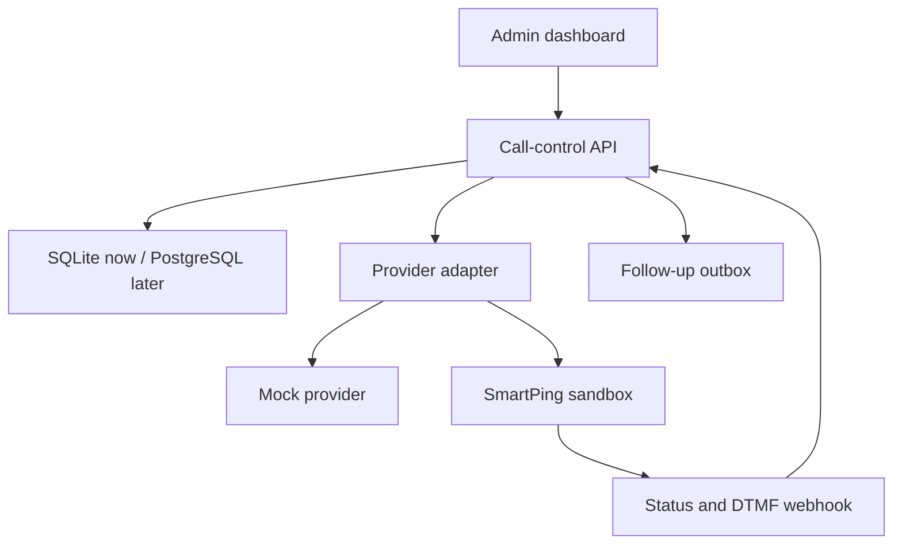

# AI Call Center Starter

A provider-independent foundation for outbound IVR campaigns and future AI voice calls.

- **Phase 1:** mock call lifecycle
- **Phase 2:** outbound call-centre MVP (`CALL_PROVIDER=mock`)
- **Phase 3A:** SmartPing VoiceStreaming protocol foundation + local simulator (still fail-closed; no real calls)
- **Phase 3B:** Safe Railway public WebSocket exposure (`stream-only`) with temporary bearer auth
- **Phase 4A:** deterministic multilingual response engine (English + Telugu phrases). No LLM or external decision API is required.
- **Phase 4B:** self-hosted streaming STT (Silero VAD + Faster-Whisper) over a private WebSocket. Default remains `VOICE_STT_PROVIDER=mock`.
- **Phase 4C:** self-hosted Kokoro English TTS (CPU). Default remains `VOICE_TTS_PROVIDER=mock`.
- **Phase 4D:** self-hosted Piper Telugu TTS (CPU) + final local language router (`en`→Kokoro, `te`→Piper). Microsoft Edge online TTS removed. Default remains `VOICE_TTS_PROVIDER=mock`.
- **Phase 4E:** end-to-end local speech conversation lifecycle + Railway staging configs. Default remains `VOICE_CONVERSATION_ENABLED=false` (DTMF-only).
- **Phase 4E.1:** Railway speech-service bring-up with baked models, private networking, and real-audio simulator validation (`--mode audio`). See [docs/PHASE_4E1_RAILWAY_BRINGUP.md](docs/PHASE_4E1_RAILWAY_BRINGUP.md).
- **Phase 4E.2:** Real-audio stabilization (VAD trailing silence, strict listening/STT readiness, fixture bank, direct STT gate). See [docs/PHASE_4E2_REAL_AUDIO_STABILIZATION.md](docs/PHASE_4E2_REAL_AUDIO_STABILIZATION.md).
- **Phase 4E.3:** CPU-safe English TTS via Piper (`local-cpu`); Kokoro optional/offline only on current Railway CPU. Gates C–F + drills passed on `speech-e2e` — see [docs/PHASE_4E3_CPU_SAFE_ENGLISH_TTS.md](docs/PHASE_4E3_CPU_SAFE_ENGLISH_TTS.md).
- **Phase 4F:** Controlled consented SmartPing sandbox call (English-only). Complete 4F-A preflight first; never auto-run `--confirm` — see [docs/PHASE_4F_CONTROLLED_SMARTPING_CALL.md](docs/PHASE_4F_CONTROLLED_SMARTPING_CALL.md).

The default configuration **never places a real telephone call**.

## Phase 2 features

- Application shell with Dashboard, Leads, Campaigns, Calls, Follow-ups, and Provider Settings
- Lead management with consent, Do-Not-Call, tags, search/filter, edit, and CSV import
- Campaign management with keypad/DTMF action labels, lead assignment, eligibility preview, and confirmed mock start
- Mock call execution with simulation controls for ringing, answered, busy, no-answer, failed, completed, and keys 1/2/3/9
- Call history with interpreted responses, timestamps, event timeline, and raw payloads
- Provider-independent follow-up outbox (email / callback / human-agent) — no real email sending
- Dashboard analytics with safe zero-division handling
- Non-secret provider settings status page

## Phase 3A features

- SmartPing bidirectional WebSocket voice-stream endpoint
- Normalized handling for `connected`, `start`, `media`, `mark`, `stop`
- Paced μ-law media output (160-byte / 20 ms chunks)
- Outbound commands: media, mark, clear, hangupCall, queue/external transfer
- Mock STT → deterministic response engine (or mock agent) → mock TTS pipeline (no LLM / external AI APIs)
- Dry-run SmartPing outbound request builder with token redaction
- Local SmartPing stream simulator
- Provider Settings streaming status flags (no secrets)

See [docs/SMARTPING_VOICE_STREAMING.md](docs/SMARTPING_VOICE_STREAMING.md).
See [docs/DETERMINISTIC_RESPONSE_ENGINE.md](docs/DETERMINISTIC_RESPONSE_ENGINE.md) for Phase 4A.
See [docs/PHASE_4B_STREAMING_STT.md](docs/PHASE_4B_STREAMING_STT.md) for Phase 4B.
See [docs/PHASE_4C_KOKORO_TTS.md](docs/PHASE_4C_KOKORO_TTS.md) for Phase 4C.
See [docs/PHASE_4D_PIPER_TELUGU_TTS.md](docs/PHASE_4D_PIPER_TELUGU_TTS.md) for Phase 4D.
See [docs/PHASE_4E_END_TO_END_RAILWAY.md](docs/PHASE_4E_END_TO_END_RAILWAY.md) for Phase 4E.

### Live audio flow

```text
Customer speech
→ SmartPing WebSocket
→ STT
→ AI agent
→ TTS
→ μ-law 8 kHz conversion
→ 160-byte paced WebSocket media
→ Customer
```

## Requirements

- Node.js 24 or newer
- `npm install` (installs the maintained `ws` package)

## Run locally

```bash
cp .env.example .env
npm install
npm start
```

Open <http://127.0.0.1:8787>.

Development watch mode:

```bash
npm run dev
```

Local SmartPing stream simulator (app must already be running):

```bash
npm run simulate:smartping-stream
```

Remote / authenticated simulator:

```bash
npm run simulate:smartping-stream -- \
  --url wss://<domain>/ws/voice/smartping \
  --token <stream-test-secret>
```

Railway deployment guide: [docs/RAILWAY_DEPLOYMENT.md](docs/RAILWAY_DEPLOYMENT.md).

## Test

```bash
npm test
```

## CSV template

Sample file: [`examples/leads-sample.csv`](examples/leads-sample.csv)

Required columns:

- `name`
- `phone` (E.164, for example `+919876543210`)

Optional columns:

- `email`
- `consent_status` (`pending`, `granted`, `denied`, `revoked`) or `consent` (`true` / `false`)
- `do_not_call`
- `language`
- `tags` (comma or pipe separated)
- `source`
- `notes`

Import never starts calls automatically. Duplicate phone numbers are skipped.

## Mock campaign walkthrough

1. Open **Leads** and import `examples/leads-sample.csv` (includes one pending-consent lead and one Do-Not-Call lead).
2. Open **Campaigns**, create an IVR campaign, assign the imported leads, and customize keypad labels if needed.
3. Click **Eligibility** and confirm only consented, non-DNC leads are eligible.
4. Click **Start** and confirm the prompt.
5. Open **Calls** and simulate outcomes:
   - Key 1 → email follow-up task
   - Key 2 → callback task
   - Key 3 → not interested for that campaign
   - Key 9 → human-agent task
6. Open **Follow-ups** and **Dashboard** to verify tasks and metrics.

## Environment variables

| Variable | Purpose |
|---|---|
| `HOST` / `PORT` | Bind address (default `127.0.0.1:8787`) |
| `DATABASE_PATH` | SQLite file path |
| `CALL_PROVIDER` | Keep `mock` for Phase 3A |
| `PUBLIC_BASE_URL` | Public base URL used for webhook URLs |
| `WEBHOOK_SECRET` | Shared secret for provider webhooks |
| `FOLLOW_UP_LINK_PLACEHOLDER` | Link stored on email follow-up tasks |
| `SMARTPING_BASE_URL` | SmartPing API host (optional for dry-run previews) |
| `SMARTPING_OUTBOUND_PATH` | Default voicebot call path from docs |
| `SMARTPING_API_TOKEN` | Secret token — never logged or returned by APIs |
| `SMARTPING_DID_NUMBER` | Caller DID for outbound voicebot calls |
| `SMARTPING_STREAM_URL` | Public/local WebSocket URL SmartPing should dial into |
| `SMARTPING_DRY_RUN` | `true` by default — no network outbound call |
| `SMARTPING_LIVE_CALLS_ENABLED` | `false` by default — fail-closed |
| `SMARTPING_STORE_AUDIO` | `false` by default — store sizes/metadata only |

## API route summary

| Method | Route | Purpose |
|---|---|---|
| `GET` | `/health` | Health and active provider |
| `GET` | `/api/dashboard` | Analytics and recent activity |
| `GET` | `/api/settings` | Non-secret provider configuration status |
| `GET/POST` | `/api/leads` | List or create leads |
| `GET/PATCH` | `/api/leads/:id` | Lead detail or update |
| `POST` | `/api/leads/import` | CSV import |
| `GET/POST` | `/api/campaigns` | List or create campaigns |
| `GET/PATCH` | `/api/campaigns/:id` | Campaign detail or update |
| `POST` | `/api/campaigns/:id/leads` | Assign leads |
| `GET` | `/api/campaigns/:id/eligibility` | Eligible vs excluded leads |
| `POST` | `/api/campaigns/:id/start` | Start mock calls (`confirm: true` required) |
| `GET` | `/api/calls` | Searchable call list |
| `GET` | `/api/calls/:id` | Call detail, events, follow-ups |
| `POST` | `/api/calls/test` | Start one test call |
| `GET` | `/api/calls/:id/events` | Event history |
| `GET` | `/api/follow-ups` | Follow-up outbox |
| `PATCH` | `/api/follow-ups/:id` | Complete/cancel follow-up |
| `POST` | `/api/mock/calls/:id/events` | Mock simulation (mock provider only) |
| `POST` | `/webhooks/providers/:provider` | Provider webhooks |
| `GET` | `/api/streams` | Active/stored voice streams |
| `GET` | `/api/streams/:streamSid` | Stream detail + event metadata |
| `POST` | `/api/streams/:streamSid/commands` | Local stream commands (clear/hangup/transfer/mark) |
| `POST` | `/api/smartping/outbound/preview` | Dry-run redacted outbound request preview |
| `WS` | `/ws/voice/smartping` | SmartPing voice streaming endpoint |

## SmartPing integration boundary

Phase 3A streaming protocol code lives in `src/streaming/` and stays isolated from core IVR `CallService`.

Still pending before live activation:

1. Official outbound success/error response samples (provider call ID field)
2. CDR/status webhook + DTMF field mapping in `normalizeWebhook`
3. Sandbox token/DID/consented number and live-call enablement

See [docs/SMARTPING_INTEGRATION.md](docs/SMARTPING_INTEGRATION.md) and [docs/SMARTPING_VOICE_STREAMING.md](docs/SMARTPING_VOICE_STREAMING.md).

## Remaining work

- Live SmartPing sandbox call after remaining provider docs/credentials arrive
- Replace mock STT/agent/TTS with a real AI provider
- Real email delivery (Gmail/SMTP or ESP) using the follow-up outbox
- Admin authentication, roles, audit logs, and PostgreSQL
- Campaign scheduling workers and retry automation

## Architecture


